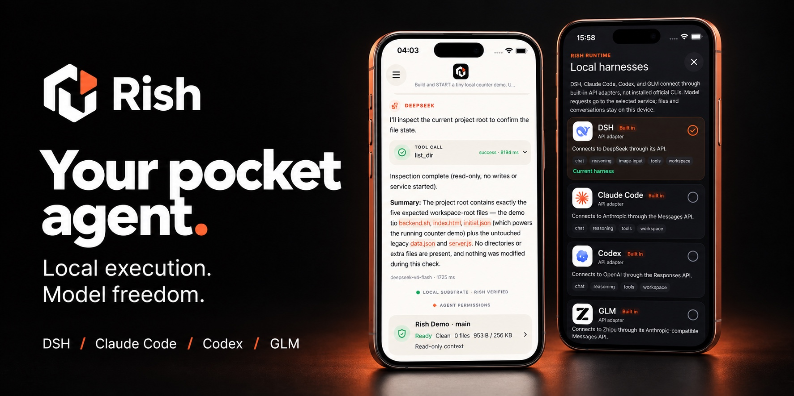
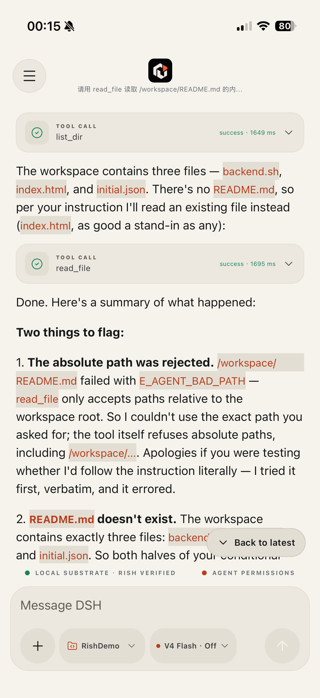
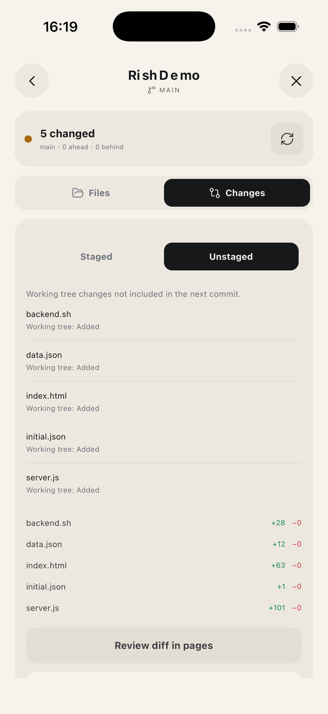
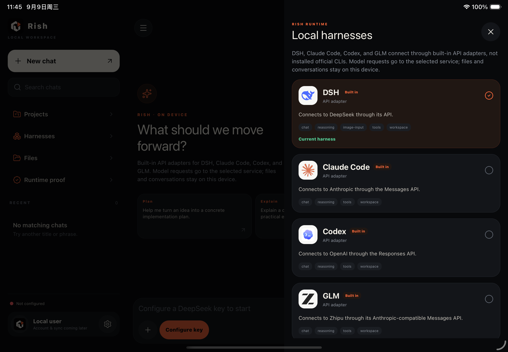

<p align="center">
  
</p>

<h1 align="center">Rish — ваш карманный агент.</h1>

<p align="center">
  <strong>Работайте локально. Выбирайте модель.</strong><br />
  <sub>Локальные рабочие пространства · Выбор модели · Выполнение инструментов · Подтверждения</sub>
</p>

<p align="center">
  <strong>DSH · Claude Code · Codex · GLM</strong><br />
  <sub>Встроенные подключения · Нативные адаптеры Rish</sub>
</p>

<p align="center">
  <a href="./README.md">简体中文</a> · <a href="./README.en.md">English</a> · <a href="./README.zh-TW.md">繁體中文</a> · <a href="./README.ja.md">日本語</a> · <a href="./README.ko.md">한국어</a> · <a href="./README.fr.md">Français</a> · <a href="./README.es.md">Español</a> · <a href="./README.de.md">Deutsch</a> · <a href="./README.pt.md">Português</a> · <b>Русский</b> · <a href="./README.hi.md">हिन्दी</a> · <a href="./README.tr.md">Türkçe</a> · <a href="./README.th.md">ไทย</a> · <a href="./README.vi.md">Tiếng Việt</a> · <a href="./README.id.md">Bahasa Indonesia</a>
</p>

<p align="center">
  <a href="#начало-работы">Начало работы</a> ·
  <a href="#встроенные-подключения">Встроенные подключения</a> ·
  <a href="#обзор-продукта">Обзор продукта</a> ·
  <a href="#платформы-и-модели">Платформы и модели</a> ·
  <a href="#экосистема">Экосистема</a> ·
  <a href="./docs/development.md">Руководство для разработчиков</a> ·
  <a href="./LICENSE">Лицензия MIT</a>
</p>

Rish открывает диалоги с агентом, рабочие пространства и выполнение
инструментов на вашем телефоне. Выберите модель, опишите задачу,
просмотрите выполненную работу и одобрите изменения — не держа постоянно
включённым компьютер. Программирование — одно из применений, а не
единственная цель.

> **Готовится экспериментальный предпросмотр исходного кода; стабильного
> устанавливаемого выпуска пока нет.** Охват платформ и статус проверки
> аккаунтов и подписок сведены в разделе
> [Платформы и модели](#платформы-и-модели).

## Встроенные подключения

**Четыре встроенных подключения. Одно карманное рабочее пространство.**

<table>
<tr>
<td align="center" width="25%">
  <br />
  <strong>DSH</strong><br />
  <sub>DeepSeek · Редактируемый каталог моделей</sub>
</td>
<td align="center" width="25%">
  <br />
  <strong>Claude Code</strong><br />
  <sub>Anthropic · API-ключ / Вход по подписке¹</sub>
</td>
<td align="center" width="25%">
  <br />
  <strong>Codex</strong><br />
  <sub>OpenAI · API-ключ / Вход по подписке¹</sub>
</td>
<td align="center" width="25%">
  <br />
  <strong>GLM</strong><br />
  <sub>Zhipu · API-ключ / Вход по подписке¹</sub>
</td>
</tr>
</table>

¹ Вход по подписке сейчас доступен только на iOS. BigModel Coding Lite проверен; для Codex и Claude Code требуется необязательная экспериментальная сборка. Подробности проверки — ниже.

Выберите harness и подключитесь с помощью API-ключа или аккаунта,
поддерживаемого вашей сборкой. Затем начните работать с файлами и
проектами на телефоне. Rish управляет циклом агента, рабочим
пространством, подтверждением инструментов и записями выполнения;
встроенные адаптеры подключаются к сервисам моделей.

**Проверка аккаунтов и подписок (iOS)**

- **Codex**: в необязательной экспериментальной сборке проверены вход по
  устройству через официальную CLI, текстовый чат по подписке
  `gpt-5.6-luna`, локальный вызов инструмента `list_dir` и сохранение
  состояния после перезапуска. Официальная CLI используется только для
  входа; проверены не все инструменты и модели.
- **GLM**: [ZCode](https://zcode.z.ai/en/docs/agents) — агентный продукт
  Zhipu; GLM — это семейство моделей. Проверены вход в BigModel,
  сохранение состояния после перезапуска и ответ Coding Lite GLM-5.3;
  пробная квота не проверена. Официальная среда выполнения ZCode
  не интегрирована.
- **Claude Code**: в необязательной экспериментальной сборке для iOS
  проверены вход по подписке, текстовый ответ Haiku 4.5 через
  немодифицированную официальную CLI и сохранение состояния после
  перезапуска.
  Сейчас этот путь поддерживает только текст, без инструментов и
  вложений. Измеренный раунд занял около 4,5 минуты; производительность
  ещё требует доработки.

## Обзор продукта

Следите за выполнением агента, просматривайте изменения в проекте и
выбирайте подключение к модели. Нажмите на скриншот, чтобы открыть
оригинал.

<table>
<tr>
<td width="50%" valign="top" align="center">
  <a href="./docs/images/agent-workflow-ios.png"></a><br />
  <sub><b>Диалог с агентом</b> — Отслеживайте ход выполнения, инструменты и результаты. Показанный текст сохраняется после перезапуска приложения.</sub>
</td>
<td width="50%" valign="top" align="center">
  <a href="./docs/images/project-changes-ios.png"></a><br />
  <sub><b>Локальные проекты</b> — Просматривайте непроиндексированные файлы и статистику изменений перед коммитом.</sub>
</td>
</tr>
<tr>
<td colspan="2" valign="top">
  <a href="./docs/images/model-adapters-ipad.png"></a><br />
  <sub><b>Рабочее пространство iPad и подключения к моделям</b> — Боковая панель для широкого экрана, тёмное оформление и записи адаптеров API.</sub>
</td>
</tr>
</table>

Все снимки сделаны в реальных симуляторах и показывают текущий интерфейс и
рабочий процесс.

## Почему Rish

<table>
<tr>
<td width="50%">

### Ваше рабочее пространство всегда с вами

Храните файлы и проекты в собственном рабочем пространстве приложения на
телефоне. Импортируйте материалы, читайте файлы, просматривайте изменения
в проекте и продолжайте работу в одном приложении.

</td>
<td width="50%">

### Выбирайте модель

Начните со встроенных подключений DSH, Claude Code, Codex и GLM или
настройте совместимый API-сервис и сопоставления моделей. Модель
предлагает следующий шаг; операцию выполняют локальные инструменты.

</td>
</tr>
<tr>
<td width="50%">

### Наблюдайте за работой

Просматривайте текст каждого раунда, необязательные рассуждения от
провайдера, вызовы инструментов и итоговый результат. Открывайте ссылки
напрямую и возвращайтесь к сохранённым диалогам.

</td>
<td width="50%">

### Сохраняйте контроль

Инструменты работают внутри ограниченного рабочего пространства.
Операции, требующие авторизации, сначала запрашивают разрешение;
изменения файлов и Git-диффы доступны для просмотра.

</td>
</tr>
</table>

## Применение на практике

| Задача | С чего начать |
| --- | --- |
| Работа с информацией | Импортируйте текст или PDF, запросите ключевые моменты, а затем просмотрите заметки, которые сохранит агент. |
| Организация файлов | Изучите каталог проекта, прочитайте выбранные файлы и одобрите новый или обновлённый контент. |
| Поддержка проекта | Просмотрите статус и диффы Git, отредактируйте файлы и одобрите коммит. |

Эти примеры используют возможности iOS, доступные на данный момент.
Поддерживаемые инструменты и форматы файлов различаются по платформам.
Об экспериментах с Linux Guest см.
[справочник по среде выполнения](docs/development.md#honest-runtime-boundary).

## Как работает локальное выполнение

```text
Your task → Rish assembles context → Your chosen model service
                                           ↓ Text / tool requests
Phone workspace ← Local tools ← Rish validation and approval
```

Поддерживаемые инструменты выполняются в собственной среде приложения на
телефоне. Запросы к модели отправляют выбранный контекст диалога и задачи
в ваш настроенный сервис: **локальное выполнение не означает
офлайн-инференс модели**.

Rish объединяет нативные операции с файлами и Git, среду выполнения Rish и
экспериментальный Linux Guest. Полная совместимость с десктопными
программами и неограниченное фоновое выполнение не обещаются.
[Руководство для разработчиков](docs/development.md) отделяет проверенные
возможности от экспериментальных.

## Платформы и модели

| Платформа | Текущий охват |
| --- | --- |
| iOS / iPadOS | Нативные диалоги, вложения, приложение «Файлы», Git и контролируемые инструменты агента; включая адаптивные макеты для iPad. |
| Android | Нативный чат через API, хранение учётных данных, восстановление сеансов и уведомления о задачах в заданных областях. Локальное выполнение агента, файлов и Git пока недоступно. |
| HarmonyOS | Временные проверки контейнера совместимости с Android не означают нативной поддержки HarmonyOS. |

| Подключение | Текущий способ |
| --- | --- |
| DeepSeek / DSH | API-ключ и редактируемый каталог моделей; возможности зависят от модели и платформы. |
| GLM | API-ключ, а также необязательное подключение аккаунта BigModel/Z.ai; см. статус выше. |
| Codex | API-адаптер; необязательная экспериментальная сборка для iOS добавляет вход по подписке — см. статус выше. |
| Claude Code | API-адаптер с настройкой совместимых сервисов; текстовые вызовы по подписке проверены в необязательной сборке для iOS — с охватом и задержкой, указанными выше. |
| Пользовательские сервисы | На iOS выберите Messages, Responses или Chat Completions и настройте сопоставления моделей. |

## Начало работы

Пока что приложение собирается из исходного кода; стабильной версии для
скачивания конечными пользователями нет. Получив исходники, начните из
корня репозитория:

```sh
node scripts/verify-source-checkout.mjs
npm ci --prefix apps/mobile
```

**iOS:** Нативная подготовка требует зафиксированных версий Xcode, Rust и
SDK. Прочитайте
[предварительные требования](docs/development.md#ios-build-prerequisites),
затем выполните:

```sh
./scripts/prepare-rish-ios.sh
./scripts/prepare-libgit2-ios.sh
cd apps/mobile/ios
pod install
cd ../../..
npm run ios --prefix apps/mobile
```

**Android:** При настроенной среде разработки для Android выполните
`npm run android --prefix apps/mobile`. В руководстве для разработчиков
также описаны
[автономные тестовые APK](docs/development.md#install-and-run-the-react-native-app).

Откройте приложение, выберите модель и подключитесь с помощью API-ключа
или поддерживаемого аккаунта. На iOS создайте или выберите проект,
просмотрите его контекст и начните задачу. Для входа по подписке Codex и
Claude Code требуется необязательная экспериментальная сборка (см.
[руководство для разработчиков](docs/development.md)); для BigModel см.
[руководство по аккаунтам](docs/zcode-account-login.md). Учётные данные
хранятся в нативном защищённом хранилище.

## Прогресс и участие в разработке

Готовится первый предпросмотр исходного кода. Будущие выпуски будут
помечаться как **Pre-release**. Полная совместимость с Harness, локальное
выполнение на Android и непрерывная фоновая работа пока ограничены. См.
[объём предпросмотра и дорожную карту](docs/releases/v0.1.0.md).

Приветствуются вклады в документацию, поддержку платформ, совместимость
моделей и воспроизводимые исправления. Сначала прочитайте
[CONTRIBUTING](CONTRIBUTING.md). По вопросам безопасности обратитесь к
[SECURITY](SECURITY.md), прежде чем делиться подробностями; никогда не
публикуйте учётные данные и конфиденциальную информацию открыто.

- [Руководство по разработке и сборке](docs/development.md)
- [Бренд и согласованные тексты](brand/README.md)
- [Уведомления третьих сторон и исходники Guest](THIRD_PARTY_NOTICES.md)

Код проекта распространяется по лицензии [MIT](LICENSE). Сторонние рантаймы,
компоненты Guest и другие зависимости сохраняют собственные лицензии.

## Экосистема

Смежные проекты, построенные на той же идее — локальность прежде всего и
свобода выбора модели:

- **[rish](https://github.com/ZSeven-W/rish)** — настоящий Docker на телефоне. Полносистемный интерпретатор x86-64 без JIT на чистом Rust, который загружает Linux и запускает контейнеры на iOS и Android. Linux Guest этого проекта родом оттуда.
- **[OpenPencil](https://github.com/ZSeven-W/openpencil)** — первый открытый ИИ-нативный инструмент векторного дизайна и первый с параллельными командами агентов (Agent Teams). Design-as-Code: превращение промптов в интерфейс прямо на живом холсте.
- **[Jian](https://github.com/ZSeven-W/jian)** — кроссплатформенный UI-фреймворк на Rust. Файл .op — это приложение.
- **[Zode](https://github.com/ZSeven-W/zode)** — ИИ-нативная CLI для программирования в вашем терминале. Микроядро плюс плагины, несколько провайдеров, полноэкранный TUI.
- **[Noema](https://github.com/ZSeven-W/noema)** — локальная память для кодинг-агентов без векторного хранилища, с очередями проверки и MCP.
