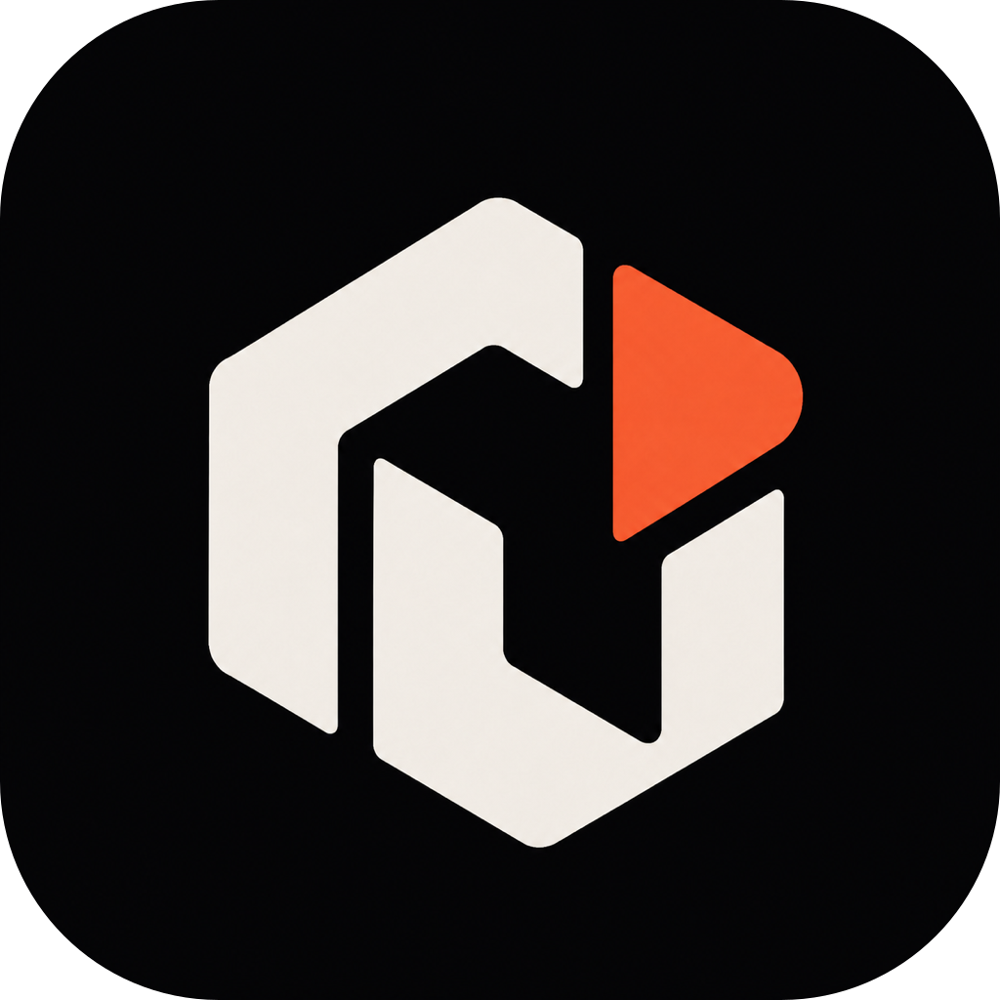

<p align="center">
  
</p>

<h1 align="center">Rish, agent trong túi của bạn.</h1>

<p align="center">
  <strong>Chạy cục bộ. Chọn mô hình của bạn.</strong><br />
  <sub>Không gian làm việc cục bộ · Lựa chọn mô hình · Thực thi công cụ · Phê duyệt</sub>
</p>

<p align="center">
  <strong>DSH · Claude Code · Codex · GLM</strong><br />
  <sub>Kết nối tích hợp sẵn · Bộ điều hợp Rish gốc</sub>
</p>

<p align="center">
  <a href="./README.md">English</a> · <a href="./README.zh.md">简体中文</a> · <a href="./README.zh-TW.md">繁體中文</a> · <a href="./README.ja.md">日本語</a> · <a href="./README.ko.md">한국어</a> · <a href="./README.fr.md">Français</a> · <a href="./README.es.md">Español</a> · <a href="./README.de.md">Deutsch</a> · <a href="./README.pt.md">Português</a> · <a href="./README.ru.md">Русский</a> · <a href="./README.hi.md">हिन्दी</a> · <a href="./README.tr.md">Türkçe</a> · <a href="./README.th.md">ไทย</a> · <b>Tiếng Việt</b> · <a href="./README.id.md">Bahasa Indonesia</a>
</p>

<p align="center">
  <a href="#bắt-đầu">Bắt đầu</a> ·
  <a href="#kết-nối-tích-hợp-sẵn">Kết nối tích hợp sẵn</a> ·
  <a href="#tham-quan-sản-phẩm">Tham quan sản phẩm</a> ·
  <a href="#nền-tảng-và-mô-hình">Nền tảng và mô hình</a> ·
  <a href="#hệ-sinh-thái">Hệ sinh thái</a> ·
  <a href="./docs/development.md">Hướng dẫn nhà phát triển</a> ·
  <a href="./LICENSE">Giấy phép MIT</a>
</p>

<p align="center">
  
</p>

Rish mang các cuộc hội thoại Agent, không gian làm việc và việc thực thi công cụ
đến điện thoại của bạn. Chọn một mô hình, mô tả một nhiệm vụ, xem xét công việc
và phê duyệt các thay đổi mà không cần giữ một máy tính chạy liên tục. Lập trình
là một trong các công dụng, không phải mục đích duy nhất của nó.

> **Đang chuẩn bị một bản xem trước mã nguồn thử nghiệm; chưa có bản phát hành
> ổn định có thể cài đặt.** Phạm vi nền tảng và trạng thái xác minh
> tài khoản/gói đăng ký được tóm tắt trong [Nền tảng và mô hình](#nền-tảng-và-mô-hình).

## Kết nối tích hợp sẵn

**Bốn kết nối tích hợp sẵn. Một không gian làm việc trong túi.**

<table>
<tr>
<td align="center" width="25%">
  <br />
  <strong>DSH</strong><br />
  <sub>DeepSeek · Danh mục mô hình có thể chỉnh sửa</sub>
</td>
<td align="center" width="25%">
  <br />
  <strong>Claude Code</strong><br />
  <sub>Anthropic · Khóa API / Đăng nhập bằng gói đăng ký¹</sub>
</td>
<td align="center" width="25%">
  <br />
  <strong>Codex</strong><br />
  <sub>OpenAI · Khóa API / Đăng nhập bằng gói đăng ký¹</sub>
</td>
<td align="center" width="25%">
  <br />
  <strong>GLM</strong><br />
  <sub>Zhipu · Khóa API / Đăng nhập bằng gói đăng ký¹</sub>
</td>
</tr>
</table>

¹ Đăng nhập bằng gói đăng ký hiện chỉ khả dụng trên iOS. BigModel Coding Lite đã
được xác minh; Codex và Claude Code yêu cầu bản dựng thử nghiệm tùy chọn. Xem
chi tiết xác minh bên dưới.

Chọn một bộ khung và kết nối bằng khóa API hoặc một tài khoản được bản dựng của
bạn hỗ trợ. Sau đó bắt đầu làm việc với tệp và dự án trên điện thoại. Rish quản
lý vòng lặp agent, không gian làm việc, việc phê duyệt công cụ và hồ sơ thực
thi; các bộ điều hợp tích hợp sẵn kết nối đến các dịch vụ mô hình.

**Xác minh tài khoản và gói đăng ký (iOS)**

- **Codex**: bản dựng thử nghiệm tùy chọn đã xác minh việc đăng nhập thiết bị
  qua CLI chính thức, một cuộc trò chuyện văn bản `gpt-5.6-luna` bằng gói đăng
  ký, một lệnh gọi công cụ `list_dir` cục bộ, và khả năng duy trì trạng thái
  qua các lần khởi động lại. CLI chính thức chỉ được dùng để đăng nhập; không
  phải mọi công cụ và mô hình đều đã được xác minh.
- **GLM**: [ZCode](https://zcode.z.ai/en/docs/agents) là sản phẩm agent của
  Zhipu; GLM là dòng mô hình. Đăng nhập BigModel, khả năng duy trì trạng thái
  qua khởi động lại, và một phản hồi GLM-5.3 của Coding Lite đã được xác minh;
  trợ cấp dùng thử thì chưa. Runtime ZCode chính thức chưa được tích hợp.
- **Claude Code**: bản dựng thử nghiệm iOS tùy chọn đã xác minh đăng nhập bằng
  gói đăng ký, một phản hồi văn bản Haiku 4.5 thông qua CLI chính thức nguyên
  bản, và khả năng duy trì trạng thái qua khởi động lại. Hiện đường dẫn này chỉ
  hỗ trợ văn bản, không có công cụ hay tệp đính kèm. Một lượt được đo mất
  khoảng 4,5 phút; hiệu suất vẫn cần cải thiện.

## Tham quan sản phẩm

Theo dõi việc thực thi của Agent, xem xét các thay đổi của dự án và chọn kết nối
mô hình. Nhấp vào ảnh chụp màn hình để mở bản gốc.

<table>
<tr>
<td width="50%" valign="top" align="center">
  <a href="./docs/images/agent-workflow-ios.png"></a><br />
  <sub><b>Cuộc hội thoại Agent</b> — Theo dõi tiến độ, các lệnh gọi công cụ và kết quả trên điện thoại. Một đường dẫn nằm ngoài không gian làm việc bị từ chối, và mô hình tự sửa lỗi ở lượt tiếp theo.</sub>
</td>
<td width="50%" valign="top" align="center">
  <a href="./docs/images/project-changes-ios.png"></a><br />
  <sub><b>Dự án cục bộ</b> — Kiểm tra các tệp chưa staged và thống kê thay đổi trước khi commit.</sub>
</td>
</tr>
<tr>
<td colspan="2" valign="top">
  <a href="./docs/images/model-adapters-ipad.png"></a><br />
  <sub><b>Không gian làm việc iPad và kết nối mô hình</b> — Thanh bên cho màn hình rộng, giao diện tối và các mục bộ điều hợp API.</sub>
</td>
</tr>
</table>

Tất cả ảnh chụp đều đến từ Simulator thực, thể hiện giao diện và quy trình làm
việc hiện tại.

## Tại sao chọn Rish

<table>
<tr>
<td width="50%">

### Không gian làm việc đồng hành cùng bạn

Giữ tệp và dự án trong không gian làm việc do ứng dụng sở hữu trên điện thoại.
Nhập tài liệu, đọc tệp, xem xét các thay đổi của dự án và tiếp tục làm việc
trong một ứng dụng duy nhất.

</td>
<td width="50%">

### Chọn mô hình của bạn

Bắt đầu với các mục DSH, Claude Code, Codex và GLM tích hợp sẵn, hoặc cấu hình
một dịch vụ API tương thích cùng ánh xạ mô hình. Mô hình đề xuất bước tiếp theo;
các công cụ cục bộ thực hiện thao tác.

</td>
</tr>
<tr>
<td width="50%">

### Xem công việc diễn ra

Theo dõi văn bản của mỗi lượt, phần suy luận do nhà cung cấp trả về (tùy chọn),
các lệnh gọi công cụ và kết quả cuối cùng. Mở liên kết trực tiếp và quay lại
các cuộc hội thoại đã lưu.

</td>
<td width="50%">

### Luôn giữ quyền kiểm soát

Các công cụ hoạt động trong một không gian làm việc có giới hạn. Các thao tác
cần ủy quyền sẽ hỏi trước; thay đổi tệp và diff Git luôn sẵn sàng để xem xét.

</td>
</tr>
</table>

## Đưa vào sử dụng

| Nhiệm vụ | Một điểm khởi đầu |
| --- | --- |
| Làm việc với thông tin | Nhập văn bản hoặc tệp PDF, yêu cầu các ý chính, rồi xem xét các ghi chú mà Agent lưu lại. |
| Tổ chức tệp | Kiểm tra thư mục dự án, đọc các tệp được chọn và phê duyệt nội dung mới hoặc cập nhật. |
| Bảo trì dự án | Xem trạng thái và diff Git, chỉnh sửa tệp và phê duyệt một commit. |

Các ví dụ này sử dụng các khả năng iOS hiện có. Các công cụ và định dạng tệp
được hỗ trợ khác nhau tùy nền tảng. Để biết về các thử nghiệm Linux Guest, xem
[tài liệu tham khảo runtime](docs/development.md#honest-runtime-boundary).

## Cách hoạt động của thực thi cục bộ

```text
Your task → Rish assembles context → Your chosen model service
                                           ↓ Text / tool requests
Phone workspace ← Local tools ← Rish validation and approval
```

Các công cụ được hỗ trợ thực thi trong môi trường do ứng dụng sở hữu trên điện
thoại. Các yêu cầu mô hình gửi phần ngữ cảnh hội thoại và nhiệm vụ được chọn
đến dịch vụ bạn đã cấu hình: **thực thi cục bộ không có nghĩa là suy luận mô
hình ngoại tuyến**.

Rish kết hợp các thao tác tệp/Git gốc, runtime Rish và một Linux Guest thử
nghiệm. Khả năng tương thích đầy đủ với chương trình máy tính để bàn và việc
thực thi nền vô thời hạn không được cam kết. [Hướng dẫn nhà phát triển](docs/development.md)
phân biệt rõ các khả năng đã xác minh và các hướng thử nghiệm.

## Nền tảng và mô hình

| Nền tảng | Phạm vi hiện tại |
| --- | --- |
| iOS / iPadOS | Hội thoại gốc, tệp đính kèm, Files, Git và các công cụ Agent được kiểm soát; bao gồm bố cục iPad thích ứng. |
| Android | Trò chuyện API gốc, lưu trữ thông tin đăng nhập, khôi phục phiên và thông báo nhiệm vụ theo phạm vi. Thực thi Agent, Files và Git cục bộ chưa khả dụng. |
| HarmonyOS | Các kiểm tra tạm thời trên bộ chứa tương thích Android chưa xác lập hỗ trợ HarmonyOS gốc. |

| Kết nối | Phương thức hiện tại |
| --- | --- |
| DeepSeek / DSH | Khóa API và danh mục mô hình có thể chỉnh sửa; khả năng phụ thuộc vào mô hình và nền tảng. |
| GLM | Khóa API, cùng kết nối tài khoản BigModel/Z.ai tùy chọn; xem trạng thái ở trên. |
| Codex | Bộ điều hợp API; bản dựng thử nghiệm iOS tùy chọn bổ sung đăng nhập bằng gói đăng ký — xem trạng thái ở trên. |
| Claude Code | Bộ điều hợp API với cấu hình dịch vụ tương thích; các cuộc gọi văn bản bằng gói đăng ký đã được xác minh trong bản dựng iOS tùy chọn, với phạm vi và độ trễ như đã nêu ở trên. |
| Dịch vụ tùy chỉnh | Trên iOS, chọn Messages, Responses hoặc Chat Completions và cấu hình ánh xạ mô hình. |

## Hệ sinh thái

Rish là một phần trong dòng công cụ ưu tiên cục bộ và AI-native đến từ **[ZSeven-W](https://github.com/ZSeven-W)**. `rish` khởi động Linux Guest bên trong ứng dụng này; những công cụ còn lại mang cùng ý tưởng đó đến các bề mặt khác — terminal, canvas thiết kế, và bộ nhớ của agent.

| Dự án | Đây là gì |
| ------- | ---------- |
| **[rish](https://github.com/ZSeven-W/rish)** | Docker thật trên điện thoại: một trình thông dịch toàn hệ thống x86-64 không cần JIT viết thuần Rust, khởi động Linux và chạy container trên iOS và Android. Linux Guest của ứng dụng này đến từ đây. |
|  **[OpenPencil](https://github.com/ZSeven-W/openpencil)** | Công cụ thiết kế vector AI-native mã nguồn mở đầu tiên, và là công cụ đầu tiên có các Agent Teams đồng thời. Design-as-Code — biến prompt thành UI trực tiếp trên canvas đang hoạt động. |
|  **[jian](https://github.com/ZSeven-W/jian)** | Framework UI thuần Rust dùng GPU-Skia. Biến một tài liệu khai báo `.op` thành ứng dụng native — không JS runtime, không DOM, không Electron. |
|  **[Zode](https://github.com/ZSeven-W/zode)** | CLI lập trình AI-native cho terminal của bạn. Một TUI Rust nhanh, đọc mã của bạn, chạy lệnh, tìm kiếm tệp và quản lý git. |
|  **[noema](https://github.com/ZSeven-W/noema)** | Bộ nhớ ưu tiên cục bộ, không dùng vector, dành cho các agent lập trình. Bộ nhớ bền vững dưới dạng các tệp có thể kiểm tra, hàng đợi xem xét, và khả năng truy hồi không cần embedding. |

## Bắt đầu

Trước mắt hãy dựng từ mã nguồn; chưa có bản tải xuống ổn định cho người dùng
cuối. Khi đã có mã nguồn, bắt đầu tại thư mục gốc của kho mã:

```sh
node scripts/verify-source-checkout.mjs
npm ci --prefix apps/mobile
```

**iOS:** Phần chuẩn bị native yêu cầu các phiên bản Xcode, Rust và SDK được
ghim. Đọc [các điều kiện tiên quyết](docs/development.md#ios-build-prerequisites),
sau đó chạy:

```sh
./scripts/prepare-rish-ios.sh
./scripts/prepare-libgit2-ios.sh
cd apps/mobile/ios
pod install
cd ../../..
npm run ios --prefix apps/mobile
```

**Android:** Với môi trường phát triển Android đã được cấu hình, chạy
`npm run android --prefix apps/mobile`. Hướng dẫn nhà phát triển cũng đề cập
đến [các APK kiểm thử độc lập](docs/development.md#install-and-run-the-react-native-app).

Mở ứng dụng, chọn một mô hình và kết nối bằng khóa API hoặc một tài khoản được
hỗ trợ. Trên iOS, tạo hoặc chọn một dự án, xem xét ngữ cảnh của nó và bắt đầu
một nhiệm vụ. Đăng nhập bằng gói đăng ký của Codex và Claude Code yêu cầu bản
dựng thử nghiệm tùy chọn (xem [hướng dẫn nhà phát triển](docs/development.md));
xem [hướng dẫn tài khoản](docs/zcode-account-login.md) cho BigModel. Thông tin
đăng nhập được giữ trong bộ lưu trữ an toàn native.

## Tiến độ và đóng góp

Bản xem trước mã nguồn đầu tiên đang được chuẩn bị. Các bản phát hành tương lai
sẽ được đánh dấu **Pre-release**. Khả năng tương thích đầy đủ với các bộ khung,
thực thi cục bộ trên Android và hoạt động nền liên tục vẫn còn hạn chế. Xem
[phạm vi và lộ trình của bản xem trước](docs/releases/v0.1.0.md).

Chúng tôi hoan nghênh các đóng góp cho tài liệu, hỗ trợ nền tảng, khả năng tương
thích mô hình và các bản sửa lỗi có thể tái hiện. Hãy đọc [CONTRIBUTING](CONTRIBUTING.md)
trước. Đối với các vấn đề bảo mật, hãy tham khảo [SECURITY](SECURITY.md) trước
khi chia sẻ chi tiết; không bao giờ đăng công khai thông tin đăng nhập hoặc dữ
liệu nhạy cảm.

- [Hướng dẫn phát triển và dựng](docs/development.md)
- [Thương hiệu và nội dung được phê duyệt](brand/README.md)
- [Thông báo bên thứ ba và mã nguồn Guest](THIRD_PARTY_NOTICES.md)

Mã nguồn của dự án được cấp phép theo [MIT](LICENSE). Các runtime bên thứ ba,
thành phần Guest và các phụ thuộc khác giữ giấy phép riêng của chúng.
